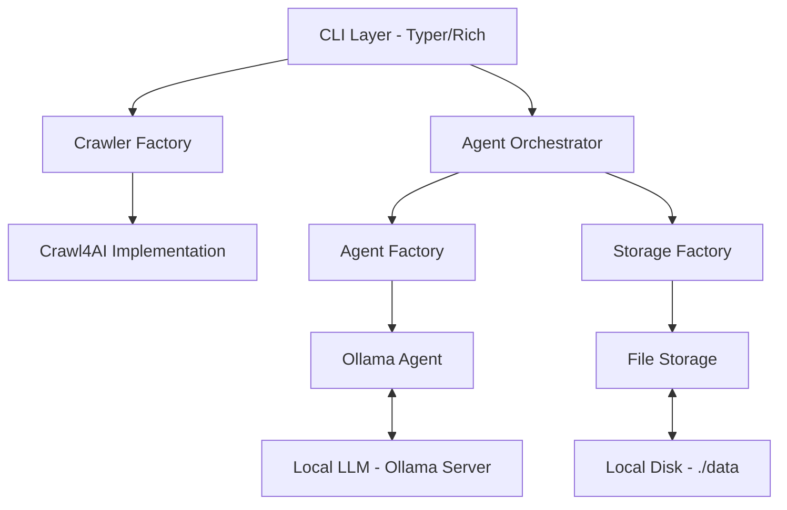

# Web Intel Architecture

Web Intel is a modular, asynchronous CLI tool designed for intelligent web crawling and AI-powered content analysis. This document outlines the system architecture and how its various components interact.

## 🏗️ High-Level Architecture

The system follows a decoupled, interface-based design allowing for easy extension of crawling engines, AI backends, and storage layers.

## 🧩 Core Components

### 1. Agent Orchestrator (`core/orchestrator.py`)
The `AgentOrchestrator` acts as the central coordinator. It is responsible for:
- Loading crawled content from storage.
- Managing conversation state (sessions).
- Constructing prompts with context for the AI Agent.
- Handling both one-shot queries and streaming responses.

### 2. Crawlers (`crawlers/`)
The crawling layer handles data acquisition.
- **BaseCrawler**: An abstract interface defining `crawl()` and `validate_url()`.
- **Crawl4AICrawler**: The default implementation using the Crawl4AI engine. It supports deep crawling (BFS strategy), automatic markdown extraction, and configurable timeouts.

### 3. AI Agents (`agents/`)
The agent layer provides the intelligence for querying content.
- **BaseAgent**: Defines the interface for `query()`, `stream_query()`, and `prepare_context()`.
- **OllamaAgent**: Communicates with local LLMs via the Ollama REST API. It includes logic for context window management (truncation) and system prompt injection.

### 4. Storage (`storage/`)
The storage layer manages persistence for crawl results and user sessions.
- **BaseStorage**: Defines how results and sessions should be saved and loaded.
- **FileStorage**: The primary implementation that stores data in structured JSON and Markdown files under a configurable data directory.

### 5. CLI Layer (`cli/`)
Built with **Typer** and **Rich**, this layer provides:
- Command-line argument parsing.
- Interactive progress indicators for long-running crawls.
- Beautifully formatted terminal output for AI responses.

## 🔄 Data Flow: Querying a Website

1.  **Request**: The user issues a `wi query ask` command.
2.  **Initialization**: The CLI initializes the `Config`, then uses factories to create an `OllamaAgent` and `FileStorage`.
3.  **Context Loading**: The `AgentOrchestrator` reads the specified source file from disk.
4.  **Session Retrieval**: If a session ID is provided, previous messages are loaded to provide conversation memory.
5.  **Inference**:
    - The orchestrator builds a prompt containing: System instructions + Crawled Content + History + User Question.
    - The agent sends this to the Ollama server.
6.  **Persistence**: The AI's response is appended to the session file, and the answer is printed to the terminal.

## ⚙️ Configuration

Configuration is managed via Pydantic Settings in `core/config.py`. Settings are loaded in the following order of priority:
1.  Environment variables (prefixed with `WEB_INTEL_`).
2.  `.env` file.
3.  Default values in the `Config` class.

## 🚀 Extensibility

The architecture is designed for growth:
- **New Agents**: Implement `BaseAgent` to support OpenAI, Anthropic, or other local providers.
- **New Crawlers**: Implement `BaseCrawler` to use Playwright, Selenium, or specialized scrapers.
- **New Storage**: Implement `BaseStorage` to support SQLite, PostgreSQL, or Vector Databases for RAG-style retrieval.
